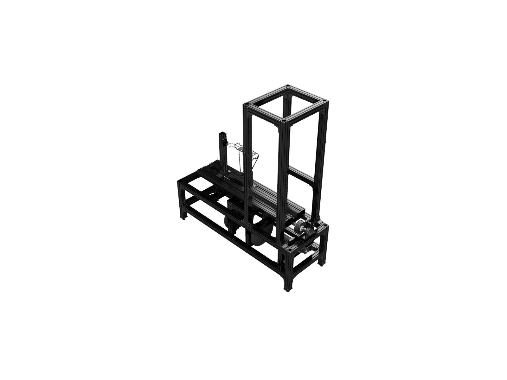
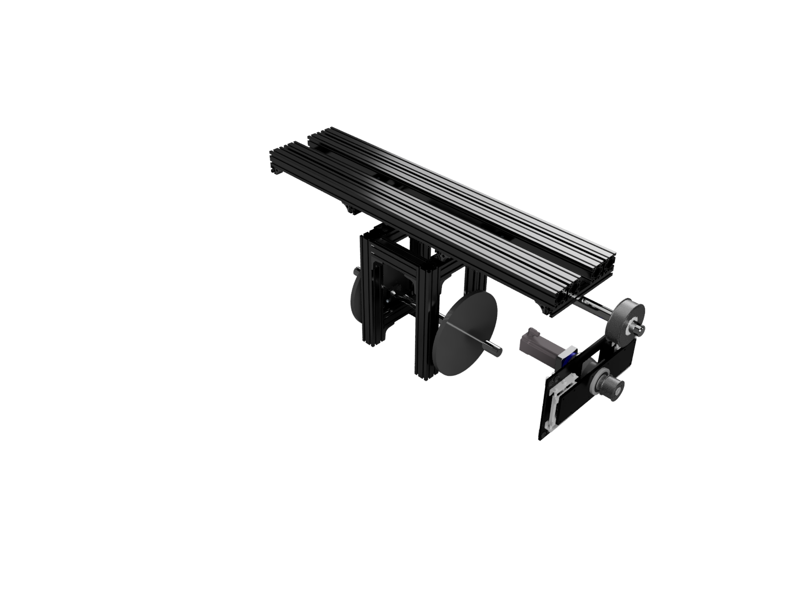
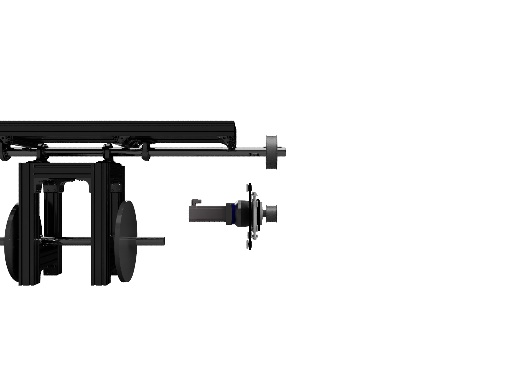
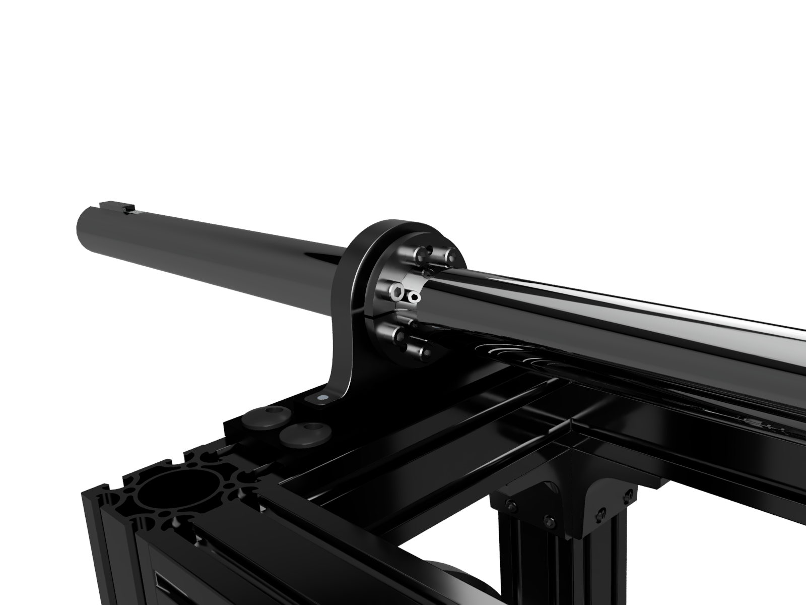

## Project Background
Every bicycle rack sold by Trek must adhere to **ISO 11243**, which dictates a suite of static and fatigue tests with both vertical and horizontal forces in reference to the standard mounting position of the rack on the bicycle. 

This project was replacing an existing lateral fatigue test machine which had some limitations and elements of its design that needed to be redesigned. 
* The enclosure of the machine was too small to allow modern larger e-bikes and cargo bikes
* The machine was not rated for the larger masses involved with cargo bike testing
* The mechanism of the oscillation induced many extra oscillations and caused direction change too quickly, imparting extra load on the racks and in some cases prematurely failed bolts

I was the project lead and responsible for the **project management**, **mechanical component design**, **mechanical assembly design**, **control system design**, and **electrical design**.

## Project Deliverables

A complete machine was designed in **Onshape** with numerous **mechanical drawings**. The frame was built out of AngleLock, utilizing a **Beckhoff** control system, with safety off switches and E-Stops. The machine could oscillate 193 kg at 300 millimeters above the axis of rotation at 1 Hz with an arc of +/- 10 degrees or +/-15 degrees. A **servo motor** controlled the oscillation motion, connected to the test platform via a planetary gearbox and **Gates PowerGrip GT3 8mm belt**. A counterbalance was utilized to assist the servo motor, smooth oscillation motion, and create a fail-safe neutral position. The height of the counterbalance from the axis of rotation was fixed but the mass could be adjusted using readily-available strength training barbell plates to balance inertia around the aixs of rotation. The low mass accuracy of the barbell plates was not an issue for this application.

Dozens of fixture components were created to accommodate a wide range of bicycle frames, rear bicycle racks by themselves, front bicycle racks by themselves, and headtube mounted front bicycle racks by themselves. 

As of this writing the machine has gone through **tens of millions of cycles** and tested dozens of different test samples.  

## Project Features

#### First implementation of the Beckhoff control system
After the Test Department decided to move forward with the adoption of Beckhoff the Lateral Rack Tester was the first machine that we developed with Beckhoff.  
The machine utilized Beckhoff rotary **servo motors**, **EtherCAT** field boxes (EP series), and an integrated HMI/controller. The utilization of field boxes allowed the control panel to be placed anywhere, with only a single servo motor/encoder cable and EtherCAT cable going back to the control box, with all other sensor wires not extending beyond the machine itself. Safety toggle switches and E-Stops were implemented. 
The control system was written in **IEC 61131-3 Structured Text** in **TwinCAT 3**.

#### Calculation of torque requirements, inertia, counterbalance, and working with Beckhoff to get the correct gearbox and servo
The torque requirements were determined by the required test mass, the distance of the test mass from the axis of rotation, the range of angular motion, and the oscillation rate. The test mass could not be simplified as point mass, and instead a sum of inertias was required, treating each key mass location as a point mass. **Engineering calculations** were performed to determine the torque required by the servo motor and the torque acting on the shaft.

#### FEA and fatigue analysis for shaft selection
Due to the high number of cycles for a standard test and due to the fully reversing nature of the test, a fatigue analysis was required for the shaft. **FEA** in **Onshape** was utilized to calculate the von Mises stresses and shaft deflection. The von Mises values were then used to determine the required Steel 1045 shaft size based on **fatigue** failure. 

#### First implementation of Gates Timing belt, and selection of components
At the beginning of the project, several mechanism options were considered between traditional mechanisms that convert rotational motion into oscillation, or a rotational or linear servo or stepper in combination with a gearbox and gearing or a timing belt could be used. After all of the options were considered it was decided that a **servo motor** and **timing belt** would be the best path forward for design costs, lead time, and allowing for more shaft deflection when compared to a geared solution. Two COTS adjustable motor bases were used to control belt tension. After consulting the Gates Design Manual a Power Grip GT3 belt was selected and the subsequent calculations performed to select the components required. 

#### Usage and calculation of Fenner keyless bushings
In our effort to reduce the number of machined parts required to keep lead times low, we wanted to be able to purchase a **COTS** shaft with constant diameter. This presents problems with how to locate parts along the shaft, especially in this machine where some parts are pillow block bearings allowing rotation of the shaft, but other parts must be coupled to the shaft, and the motion of the shaft is continuously reversing. Additionally, the required length of the test platform (1850 mm) also required a long shaft so that the load could be evenly distributed along the shaft. A COTS shaft that was long enough could be obtained with keyways at the ends but not along the entire length. Designing splines or other machined features was avoided due to the aforementioned lead time concerns. I located Fenner Keyless Bushings and did some preliminary calculations to see if they would work. This was also a contributing factor in determining our final shaft size. I performed the final **calculations** and consulted with the engineering staff at Fenner to verify that the fully reversing conditions of my application would not be a problem, or would not require an additional compensating factor in the calculations for the torque ratings of the bushings. 

I utilized the design guidelines from Fenner in combination with my torque calculations to design the bushing carriers. 

After **tens of millions of cycles** the drives have not slipped from their installed position.

#### First implementation of AngleLock
This was the first project in the Test Department utilizing AngleLock. I consulted with AngleLock on the expected hold-force rating of a variety of their fasteners and designed the machine around the requirements. This was a success. The lead times were short for all components. The adjustable assembly has been very beneficial. The AngleLock system allows new fixturing to be designed and manufactured quickly, usually out of laser cut **sheet metal** parts. 
