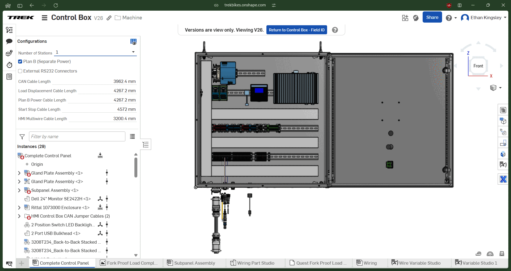

## Project Background

A background on the Fork Proof Load test requirements as described in ISO 4210 can be seen on the [Fork Proof Load 2021 Mechanical Redesign](/../portfolio/07-fpl2021/07-fpl2021) page. 

In 2023 two customers ordered Fork Proof Load machines. One needed four test stations and the other needed two test stations. After two years in service, the 2021 design was exhibiting some electrical issues and troubleshooting was difficult. As the project lead I decided an electrical redesign should be performed to create a modular mechanical and electrical design to allow for a configurable 1-4 station machine and eliminate the electrical issues plaguing the 2021 design. I was the project lead and responsible for the **project management**, **mechanical component design**, **mechanical assembly design**, and **electrical design**. 

## Project Deliverables

Two Fork Proof Load machines, one with 2 stations and the other with 4 stations were delivered in Q1 2024, roughly 10 months after the project began. Shortly after delivery I visited the installation sites and performed **Factory Acceptance Testing (FAT)**. Both machines have been in service for over a year and a half without a single issue leading to downtime.

The largest configuration of the machine utilizes 8 **pneumatic cylinders**, 20 **pneumatic valves**, an air pressure sensor, 4 **load cells**, 4 **displacement transducers**, 4 barcode scanners, 5 **PLC**s, and is compliant with the **ISO 4210 standard** for testing. The machine transfers data from the **PLC**s to a LabVIEW program pulling data from the **CAN** bus and uploading the data to an Azure server via **FTP**.

## Project Features
#### Electrical Redesign

The project required nearly a 100% redesign of the electrical system and layout compared to the [2021 version](/../portfolio/07-fpl2021/07-fpl2021). A comprehensive redesigned was performed involving up to 4 HMI control panels, 1 main control panel, dozens of new connectors, power supplies and all other necessary electrical components for safety and functionality. 

A modular approach was taken which allows the machine to be specified with 1 to 4 stations depending on the customer needs. An advanced multivariable **configuration** cascading through multiple parts and assemblies was created in **Onshape** allowing instant selection of configuration and automatic **BOM** and **mechanical drawing** creation for main control panel and its gland plates.

Up to 4 independent HMIs utilizing Horner XL4 controllers were linked via **CAN** to each other and back to a PC running a LabVIEW program to communicate to an Azure server via **FTP**. Each **pneumatic cylinder** responsible for applying the test load utilized a **load cell** and **displacement transducer** to measure load and fork flexure during the test. Each station consisted of five **pneumatic valves**. Each station also had a barcode scanner utilizing **RS232**. All control signals for sensors, relays, and all other IO were routed back to the main control panel, then to the HMI PLCs via 24 pin connectors. 

Many lessons were learned during this project. The [2025 design of the machine](/../portfolio/01-fpl2025/01-fpl2025) aggressively simplified the electrical design of the machine while retaining the modular functionality.

The delivered **wiring diagrams** and **assembly instructions** can be seen below. 



#### Mechanical Design Changes

Building off of the [2021 version](/../portfolio/07-fpl2021/07-fpl2021) of the machine there were numerous mechanical design changes to accommodate the addition of auxiliary control panels, a main control panel, and guarding for external cable routing. The previous design was migrated from **SolidWorks** to **Onshape**. The **mechanical drawings** had to be replaced for all parts due to small and large changes.  Additionally stiffness issues in the frame were seen before shipment of the 2021 version, which required the addition of additional bracing before shipment. New 3" x 3" x 1/4" tubing was added to increase the stiffness of the frame in the direction of the applied load. **Welded assemblies** were designed, many laser cut and bent **sheet metal** parts were designed, numerous **machined** parts were designed from **1040, 4140 and A2 steels** as well as **304 stainless steel**. **Design For Manufacture and Assembly (DFMA)** was deeply considered for each part.  

#### New Vendors

All machine shops and fabricators in the state of Wisconsin were evaluated on a variety of factors such as machining and fabrication abilities, post processing abilities (paint, heat treatment, etc.), perceived organization and more. 15 vendors were selected from this list to be contacted. 7 confirmed they would work on low quantity prototype runs such as the Test Department's machines. These all supplied quotes for the frame weldment and machined components. The best price, shortest lead time, and quality of relationship were then used to select the overall vendor for the project.

#### Mechanical Drawings

Over 50 pages of **mechanical drawings** were produced for the machine. A broad sampling can be seen below. A full **tolerance stack-up** was performed for all weldments and mechanical subassemblies leading to seamless assembly and reduced fabrication and machining costs. Parts received 

A few higher resolution drawings can be inspected here:

	
	
	
	
	
	


#### Large Bill of Materials

The total assembly involved a **bill of materials** of over 1000 items. Each of these items had an equivalent in **CAD** with all properties attached to the file such as supplier, material, mass, and more. All purchases and shipments were tracked in **Atlassian Jira** and **Microsoft Excel**. A new vendor CAD library structure was created to handle the electrical components- previously these were not tracked in 3D CAD by the Test Department.
