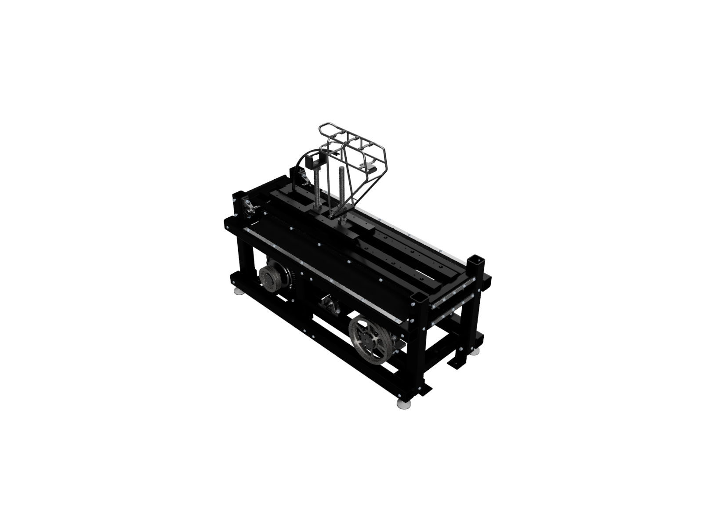
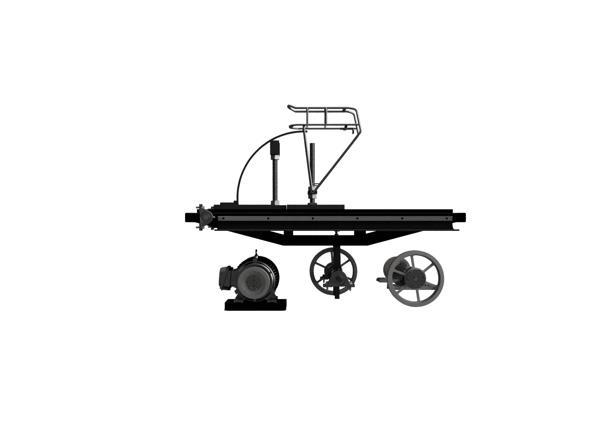
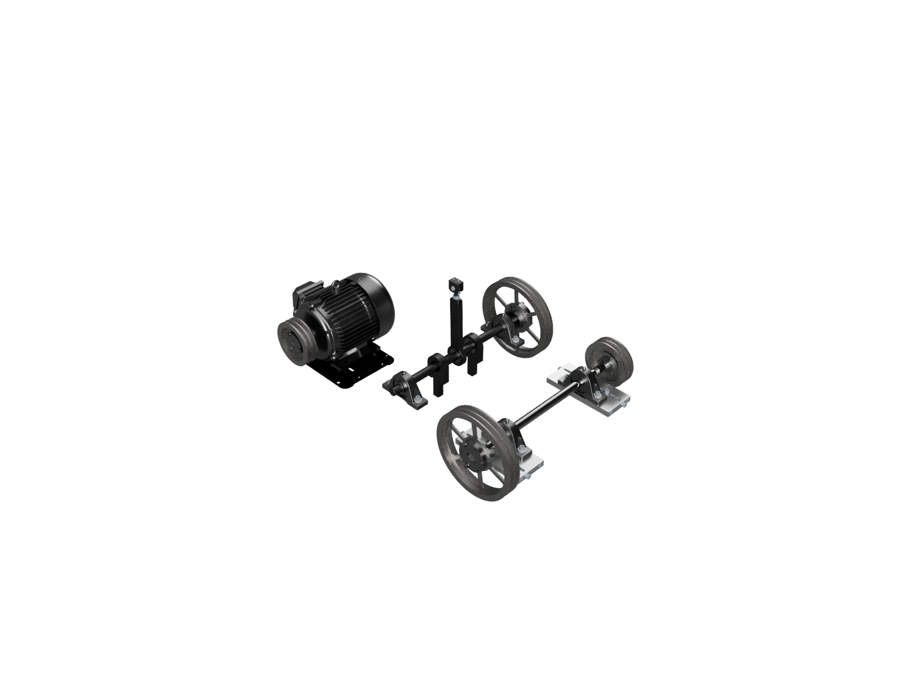
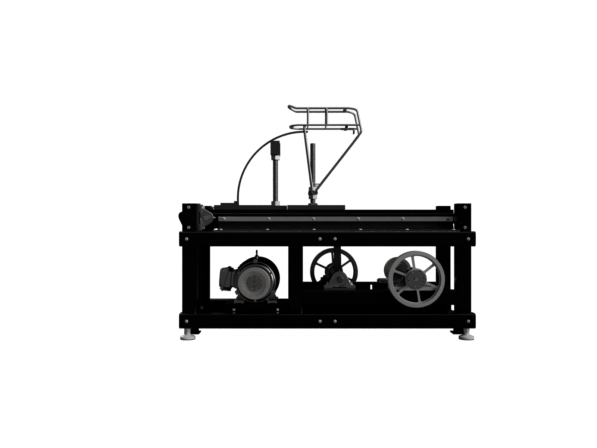
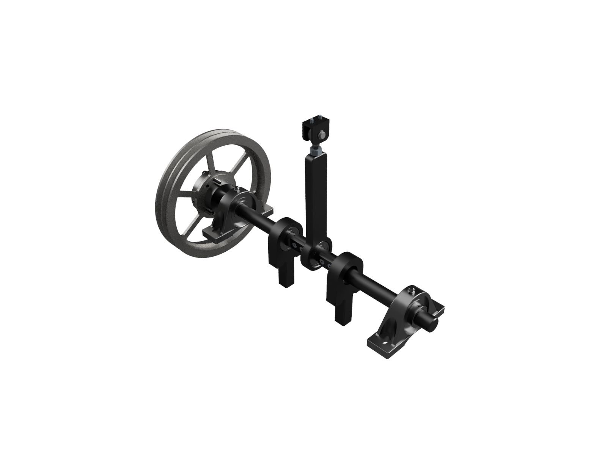

## Project Background
Every bicycle rack sold by Trek must adhere to **ISO 11243**, which dictates a suite of static and fatigue tests with both vertical and horizontal forces in reference to the standard mounting position of the rack on the bicycle. 

This was a bluesky machine design project with the following requirements
* Follow ISO 11243 Vertical Fatigue Test
	* Oscillate the test sample up to 7 Hz within a vertical range of motion as described by ISO 11243
	* The vertical range of motion must be able to be modified for different tests
* The machine must be able to oscillate a test sample with a mass up to **193 kg**
* The previous machine had an issue with pinchpoints and exposed oscillating components, requiring safety improvements

I was the project lead and responsible for **project management**, **mechanical component design**, **mechanical assembly design**. As the project lead I was also responsible for collaboration and coordination with the electrical and controls engineers on the project.

## Project Deliverables

A complete machine was designed in **Onshape** with numerous **mechanical drawings**. The **welded frame** consisted of 3" x 3" x 1/4" structural steel tubing. I designed a drive mechanism utilizing an **AC Motor** and a **Variable Frequency Drive (VFD)**. The AC motor speed was stepped down through a two-stage **V-Belt** transmission. The oscillating mechanism was designed from scratch to work with the high loads on the machine. The machine conformed to **ISO 11243** and performed **tens millions of cycles** of testing before being decomissioned due to a change in the standard requirements. The machine was also extremely quiet in general and especially when compared to the previous chain-driven machine.

## Project Features
#### V Belt Pulley Design
The final rotational speed of the oscillating mechanism is extremely low for a **V-Belt** system, so **calculations** and compensating factors needed to be carefully considered in the design. Ultimately a two-stage dual V-Belt design was implemented with adequate ratings for the required **torque** and **power** calculations.

#### AC Motor Sizing
After determining the power requirements to oscillate the test sample mass through the vertical range of motion dictated by the test standard, the AC motor was designed in conjunction with the V-Belt system to have the required power while keeping the motor as close to its natural running speed as possible.

#### 3D CAD
The machine was completely designed in **Onshape**, totalling hundreds of items on the **Bill of Materials**. A full safety guarding and sensor system (not shown in the CAD images) was created using toggle switches and a safety harness support structure. 

#### Mechanical Drawings
Dozens of **2D Mechanical Drawings** were created for the machine, with a full **tolerance stack-up** and **DFMA** performed for subassemblies, welded assemblies, and components interfacing with **COTS** parts. 

#### Oscillation Mechanism Design
The oscillating mechanism was designed so that the central offset piece could be reversed to switch between the two required vertical motion ranges. **Finite Element Analysis (FEA)** was performed to check for failure at the bolted interface. The design loads were taken into consideration in the bearing selection. Instead of a truly vertical motion, a pivoting motion was designed which was compliant with the standard tolerances for vertical motion. This reduced the required torque from the drive system.

