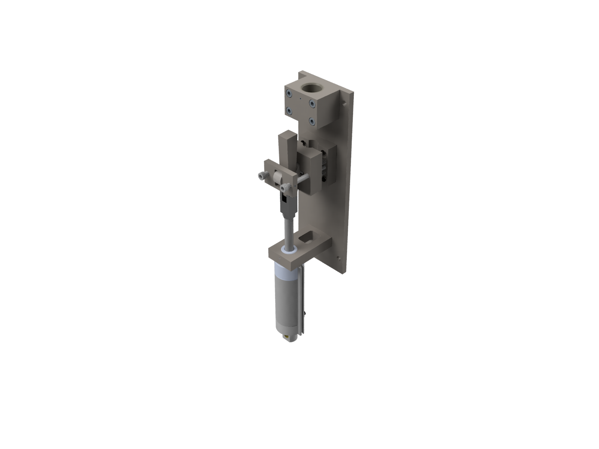
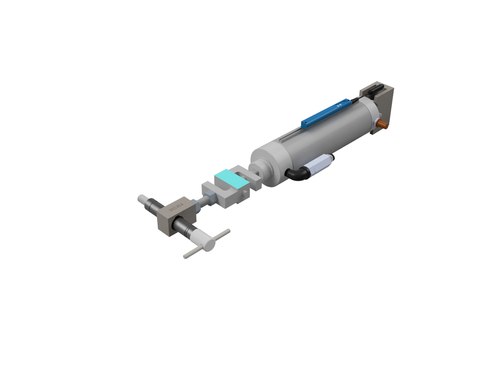

## Project Background
Every carbon fiber bicycle fork made by Trek undergoes a test known as the *Fork Proof Load Test*, where the fork is held at a standard load for 60 seconds, and the permanent deflection of the fork is measured. Forks with a permanent deflection above a certain value must be scrapped. The overall rate of scrapped forks is extremely low. The test is a more stringent version of a test described in **ISO 4210**. 

These machines are in a production environment, not a Test Lab. Accordingly they have different sealing requirements, heat and humidity tolerance requirements, and general toughness requirements compared to a machine that may go in a Test Lab. 

In 2020 a customer placed an order for a Fork Proof Load machine with 4 test stations. All previous models of Fork Proof Load machine had been designed as 2 station machines, where each station was completely indepedent from the others. The standalone nature of the stations made certain maintenance, troubleshooting, and data collection efforts more difficult, so the Test Department decided to create a 4 station machine. This was my first major project at Trek and I was responsible for the **mechanical component** design and **mechanical assembly** design. I performed **project management** for the design and purchase of all mechanical parts as well as collaboration and coordination with the electrical and controls engineers on the project.

## Final Deliverables

The machine was delivered to the customer in Q2 2021, roughly six months after the project began. The machine facilitated the accurate testing of tens of thousands of carbon fiber forks. The design was iterated upon in [Fork Proof Load Electrical Redesign (2023-2024)](/../portfolio/04-fpl2023/04-fpl2023) and [Fork Proof Load Control System Redesign (2025)](/../01-fpl2025/01-fpl2025)

## Project Features
#### Redesigned Clamp Mechanism
The previous design of the clamp was very sensitive to assembly and alignment of the components. Deficient clamp setup could result in inadequate clamping force on the steer tube of the fork. The clamp was redesigned around a rotational clevis for the wedge-cam-roller interface, guaranteeing function of the assembly independent of component alignment.

#### Redesigned Load Cylinder Mechanism
The previous design of the load cylinder mechanism and mounting plate was not height adjustable and the round cylinder shaft allowed rotation of the shaft, leading to wound-up load cables. A square shaft cylinder was implemented as well as an easily adjustable height setting.

#### New Welded Frame Design
A ground up redesign of the framework was performed to accomodate 4 stations. Numerous other improvements were made regarding ease of assembly of the machine and subassemblies, interference issues with edge case forks, internal electrical cable routing, implementation of safety guarding, and more. 

#### Redefined Tolerances on Mechanical Drawings
A full **tolerance stack-up** was performed for the welded frame and all subassemblies for the first time in the Test Department, leading to seamless assembly and reduced fabrication and machining costs.